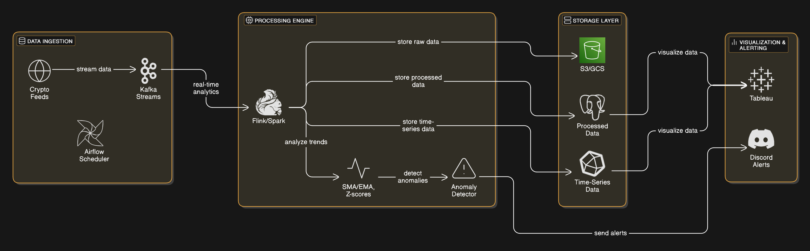
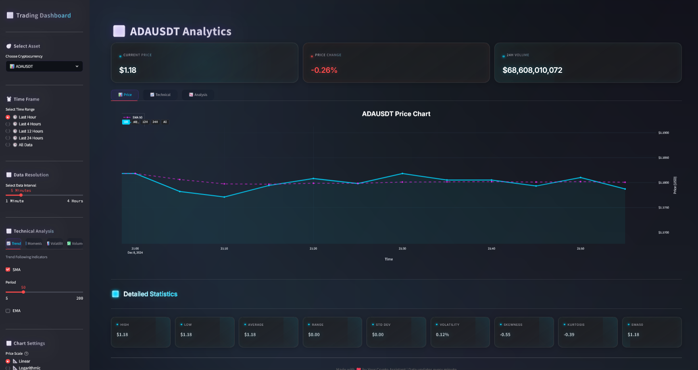

# 📊 Crypto Price Monitoring System

<div align="center">


*Real-time cryptocurrency monitoring system with advanced analytics and intelligent alerts*





[Features](#-features) • [Installation](#-installation) • [Usage](#-usage) • [Configuration](#-configuration) • [Contributing](#-contributing)

</div>

---

## 🌟 Features

<table>
<tr>
<td width="50%">

### 🔄 Real-time Monitoring
- Live cryptocurrency price tracking
- WebSocket-based data streaming
- Instant market updates
- Multi-exchange support
- Fault-tolerant data processing
- Scalable architecture

</td>
<td width="50%">

### 📈 Advanced Analytics
- SMA/EMA calculations
- Z-score analysis
- Trend detection
- Price spike detection
- Custom threshold monitoring
- Real-time data processing

</td>
</tr>
<tr>
<td>

### 🔔 Smart Alerts
- Discord notifications
- Custom price thresholds
- Trend-based alerts
- Alert history tracking
- Real-time notification system
- Configurable conditions

</td>
<td>

### 📊 Data Visualization
- Real-time price charts
- Technical indicators
- Market trends
- Price patterns
- Performance metrics
- Custom dashboards

</td>
</tr>
</table>

## 🏗️ Architecture

Our system consists of four interconnected components:

### 1️⃣ Data Ingestion Layer
- 🔹 Crypto price feeds for real-time data streaming
- 🔹 Kafka Streams for reliable message delivery
  - Partitioned topics by currency pairs
  - Fault-tolerant message delivery
- 🔹 Airflow Scheduler
  - Automated data collection
  - Data validation and cleaning

### 2️⃣ Processing Engine
- 🔹 Apache Flink/Spark for stream processing
  - Real-time analytics
  - Fault-tolerant computation
- 🔹 Technical Analysis
  - Moving averages (SMA/EMA)
  - Z-score calculations
- 🔹 Anomaly Detection
  - Price spike detection
  - Pattern recognition
  - Statistical analysis

### 3️⃣ Storage Layer
- 🔹 Raw Data Storage (S3/GCS)
  - Historical price data
  - Market events
- 🔹 Processed Data Storage
  - Aggregated metrics
  - Analysis results
- 🔹 Time-Series Data
  - Real-time price data
  - Performance metrics

### 4️⃣ Visualization & Alerting
- 🔹 Discord Integration
  - Real-time price alerts
  - Anomaly notifications
  - Custom commands
  - Alert management
- 🔹 Tableau Dashboards
  - Real-time data visualization
  - Technical analysis charts
  - Performance monitoring
  - Custom reports

## 💻 Prerequisites

Before you begin, ensure you have the following installed:
- Python 3.10+
- Docker Desktop with WSL 2 integration enabled
- Apache Airflow
- Apache Kafka
- Apache Flink
- Discord Bot Token
- Tableau Desktop/Server (optional)

## 🚀 Installation

1️⃣ **Clone the Repository**
```bash
git clone <repository-url>
cd crypto-price-monitoring
```

2️⃣ **Setup Environment**
```bash
# Run the setup script
chmod +x setup.sh
./setup.sh
```

3️⃣ **Configure Environment**
```bash
# Update the .env file with your configuration
nano .env

# Required Environment Variables:
DISCORD_BOT_TOKEN=your_discord_bot_token
DISCORD_CHANNEL_ID=your_channel_id
AIRFLOW_HOME=/path/to/airflow
TABLEAU_SERVER_URL=your_tableau_server_url  # Optional
```

## 🎮 Component Setup

### 1. Kafka Setup
```bash
# Start Kafka using Docker
docker-compose up -d kafka
```

### 2. Data Ingestion
```bash
# Start the crypto price producer
python src/data_ingestion/kafka_producer/crypto_producer.py
```

### 3. Stream Processing
```bash
# Start the price processor
python src/processing/stream_processor/price_processor.py
```

### 4. Anomaly Detection
```bash
# Start the anomaly detector
python src/processing/anomaly_detector/price_anomaly_detector.py
```

### 5. Discord Bot
```bash
# Start the alert bot
python src/visualization/discord_bot/alert_bot.py
```

### 6. Apache Airflow
```bash
# Start all services using Docker Compose
docker-compose up -d

# Initialize Airflow database (if needed)
docker exec cryptopricemonitoringsystem-airflow-webserver-1 airflow db init

# Create default admin user (if needed)
docker exec cryptopricemonitoringsystem-airflow-webserver-1 airflow users create \
    --username airflow \
    --password airflow \
    --firstname admin \
    --lastname admin \
    --role Admin \
    --email admin@example.com

# Access Airflow Web Interface
# Open http://localhost:8080 in your browser
# Login with:
# - Username: airflow
# - Password: airflow
```

## 📱 Usage

### 💹 Monitor Crypto Prices
- Automatic price fetching for configured cryptocurrencies
- Real-time processing through Kafka streams
- Customizable monitoring intervals

### 🎯 Anomaly Detection
- Statistical analysis for price movements
- Configurable detection thresholds
- Multiple detection methods:
  - Z-score analysis
  - Price change percentage
  - Pattern recognition

### 💬 Discord Commands
- `!status` - Check system status
- `!help` - Display available commands
- `!alerts` - View recent alerts
- `!configure` - Configure alert settings

## ⚙️ Configuration

### Key Configuration Files
- `.env` - Environment variables
- `config/kafka_config.yaml` - Kafka settings
- `config/monitoring_config.yaml` - Monitoring parameters
- `config/alert_config.yaml` - Alert configurations

### Customization Options
- Alert thresholds
- Monitoring intervals
- Cryptocurrency pairs
- Technical indicators
- Alert formats

## 🛠️ Development

### Code Style
```bash
# Format code
black .

# Lint code
flake8
```

### Testing
```bash
# Run tests
pytest

# Run with coverage
pytest --cov=src
```

## 📊 Monitoring

The system includes comprehensive monitoring:
- Component health checks
- Performance metrics
- Error tracking
- Alert statistics
- System logs

## 🤝 Contributing

1. Fork the repository
2. Create a feature branch (`git checkout -b feature/AmazingFeature`)
3. Commit changes (`git commit -m 'Add AmazingFeature'`)
4. Push to branch (`git push origin feature/AmazingFeature`)
5. Open a Pull Request

## 📝 License

This project is licensed under the MIT License - see the [LICENSE](LICENSE) file for details.

## 🙏 Acknowledgments

- [Yahoo Finance API](https://finance.yahoo.com/) for cryptocurrency data
- [Apache Kafka](https://kafka.apache.org/) for stream processing
- [Apache Flink](https://flink.apache.org/) for real-time analytics
- [Discord.py](https://discordpy.readthedocs.io/) for bot implementation
- [Tableau](https://www.tableau.com/) for visualization capabilities


## System Architecture

- Data Ingestion Layer: WebSocket connection to Binance for real-time crypto prices
- Message Queue: Apache Kafka for data streaming
- Stream Processing: Real-time analytics and price monitoring
- Analytics: Price statistics, moving averages, and alerts

## Prerequisites

- Python 3.10+
- Docker and Docker Compose
- WSL2 (if running on Windows)

## Setup Instructions

1. Create and activate virtual environment:
```bash
python3 -m venv venv
source venv/bin/activate  # On Windows: venv\Scripts\activate
```

2. Install dependencies:
```bash
pip install -r requirements.txt
```

3. Start Kafka services:
```bash
docker-compose up -d
```

## Running the System

1. Start the stream processor (Terminal 1):
```bash
source venv/bin/activate
python run_processor.py
```

2. Start the WebSocket feed (Terminal 2):
```bash
source venv/bin/activate
python run_crypto_feed.py
```

3. Storage Consumer (Terminal 3):
```bash
source venv/bin/activate
python run_storage.py
```

4. Start the alert processor (Terminal 4):
```bash
source venv/bin/activate
python run_alerts.py
```

5. Start the API server (Terminal 5):
```bash
python run_api.py
```

## Visualization

The system provides two visualization options:

### 1. Streamlit Dashboard

```bash
# Install dependencies (in your virtual environment)
pip install -r requirements.txt

# Create visualization directory
mkdir -p src/visualization

# Start the Streamlit app
python scripts/runners/run_streamlit.py
```

The Streamlit dashboard will be available at: http://localhost:8501

Features:
- Real-time price monitoring
- Interactive charts with Plotly
- Volume analysis
- Price change indicators
- Customizable time ranges
- Auto-refresh capability

### 2. Tableau Integration

```bash
# Set up Tableau environment
python scripts/tableau/setup_tableau.py

# Start data export service
python scripts/runners/run_tableau_export.py

# Start real-time streaming
python scripts/runners/run_tableau_stream.py
```

Tableau data will be available in:
- `tableau/data/` - Historical data exports
- `tableau/realtime/` - Real-time streaming data

## Running the Complete System

1. Start the data pipeline:
```bash
# Activate virtual environment
source venv/bin/activate  # On Unix/Mac
# or
.\venv\Scripts\activate  # On Windows

# Start Kafka services
docker-compose up -d

# Start data ingestion
python scripts/runners/run_crypto_feed.py

# Start data processing
python scripts/runners/run_processor.py

# Start data storage
python scripts/runners/run_storage.py
```

2. Start additional services:
```bash
# Start API server
python scripts/runners/run_api.py

# Start alert service
python scripts/runners/run_alerts.py
```

3. Start visualization services:
```bash
# Start Streamlit dashboard
python scripts/runners/run_streamlit.py

# Start Tableau data export
python scripts/runners/run_tableau_export.py

# Start Tableau streaming
python scripts/runners/run_tableau_stream.py
```

Each service should be run in a separate terminal window with the virtual environment activated.
