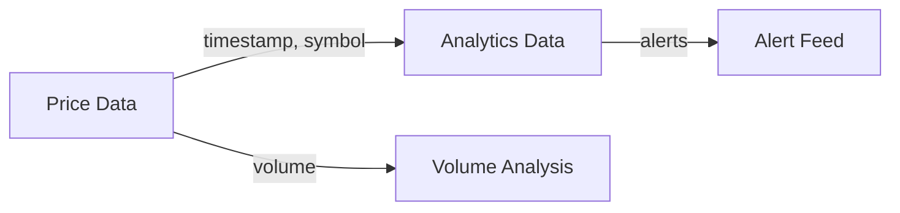

# 📊 Crypto Analytics Tableau Integration Guide

> Transform your cryptocurrency data into stunning, interactive visualizations

## 📑 Quick Navigation
- [🚀 Getting Started](#-getting-started)
- [💾 Data Sources](#-data-sources)
- [🎨 Dashboard Templates](#-dashboard-templates)
- [⚡ Advanced Features](#-advanced-features)
- [💡 Best Practices](#-best-practices)
- [🔧 Troubleshooting](#-troubleshooting)

## 🚀 Getting Started

### System Requirements
| Component | Requirement |
|-----------|-------------|
| Tableau Version | Desktop 2023.2+ |
| Memory | 8GB+ RAM |
| Storage | 1GB+ free space |
| Display | 1920x1080 or higher |

### 🔄 Initial Setup

1. **Prepare Environment**
   ```bash
   # Create necessary directories
   mkdir -p tableau/data tableau/docs
   
   # Run setup script
   python scripts/tableau/setup_tableau.py
   ```

2. **Launch Tableau**
   - Open Tableau Desktop
   - Go to `Connect to Data` > `Text file`
   - Navigate to your project's `tableau/data` directory

3. **Verify Setup**
   - Check for sample data files
   - Test data refresh
   - Configure auto-update settings

## 💾 Data Sources

### Real-time Price Feed
```sql
-- Available in: tableau/data/crypto_prices_*.csv
{
  "timestamp": "2024-01-10T14:30:00Z",
  "symbol": "BTCUSDT",
  "price": 45123.45,
  "volume": 123.45,
  "exchange": "binance"
}
```

### Analytics Data
```sql
-- Available in: tableau/data/crypto_analytics_*.csv
{
  "timestamp": "2024-01-10T14:30:00Z",
  "symbol": "BTCUSDT",
  "sma_5m": 45120.34,
  "sma_15m": 45118.67,
  "volatility": 0.0234,
  "trend": "bullish"
}
```

### Live Streaming Data
```sql
-- Available in: tableau/data/realtime_*.csv
-- Updates: Every 5 seconds
-- Retention: Last 5000 data points
```

## 🎨 Dashboard Templates

### 1. 📈 Market Pulse Dashboard


#### Components
```yaml
Header:
  - Asset Selector (Multi-select)
  - Time Range Slider
  - Exchange Filter

Main View:
  - Price Chart (70% height)
  - Volume Bars (30% height)
  
Sidebar:
  - Market Summary Cards
  - Quick Stats
  - Alert Panel
```

#### Implementation
```sql
-- Dynamic Price Change Calculator
WINDOW_AVG(([Price] - PREV_VALUE([Price])) / PREV_VALUE([Price]) * 100)
OVER (LAST 10 MINUTES)
```

### 2. 📊 Technical Analysis Suite


#### Layout
```yaml
Top Section:
  - Multi-timeframe Charts
  - Indicator Overlay Toggles
  
Middle Section:
  - Technical Indicators
    - RSI
    - MACD
    - Bollinger Bands
    
Bottom Section:
  - Volume Profile
  - Trading Session Analysis
```

#### Custom Calculations
```sql
-- Volatility Index
CASE WHEN STD([Price]) OVER (LAST 5 MINUTES) > 100 THEN
    'High Volatility 🔥'
WHEN STD([Price]) OVER (LAST 5 MINUTES) > 50 THEN
    'Medium Volatility ⚠️'
ELSE
    'Low Volatility ✨'
END
```

### 3. ⚡ Real-time Monitor


#### Features
```yaml
Live Components:
  - Ticker Tape (Top)
  - Price Heatmap (Center)
  - Alert Feed (Right)
  - Volume Radar (Bottom)

Refresh Rates:
  - Prices: 5s
  - Analytics: 15s
  - Alerts: Real-time
```

## ⚡ Advanced Features

### 🎯 Custom Alert System
```sql
-- Price Spike Detection
IF ABS([Price Change %]) > 5 THEN
    '🚨 Major Movement'
ELSEIF ABS([Price Change %]) > 2 THEN
    '⚠️ Notable Movement'
ELSE
    '✨ Normal Trading'
END
```

### 🔄 Auto-Refresh Configuration
```yaml
Real-time Data:
  - Price Feed: 5s
  - Analytics: 15s
  - Alerts: Instant

Historical Data:
  - Hourly Rollups: 60m
  - Daily Summary: 24h
  - Weekly Reports: Sunday 00:00
```

### 🔗 Data Relationships


## 💡 Best Practices

### 🎨 Visual Design Guide
```yaml
Color Scheme:
  Bullish: '#22c55e'  # Green
  Bearish: '#ef4444'  # Red
  Neutral: '#6b7280'  # Gray
  Alert: '#f59e0b'    # Amber

Typography:
  Headers: 'Roboto Bold, 16px'
  Body: 'Roboto Regular, 12px'
  Monospace: 'Consolas, 12px'
```

### ⚡ Performance Tips
1. **Data Management**
   ```sql
   -- Use efficient date filters
   [Timestamp] >= DATEADD('day', -1, NOW())
   ```

2. **Calculation Optimization**
   ```sql
   -- Cache common calculations
   FIXED [Symbol]:
       AVG([Price])
   ```

## 🔧 Troubleshooting

### Common Issues
| Issue | Solution | Status Check |
|-------|----------|--------------|
| Slow Loading | Use extracts | `Extract Last Updated` |
| Data Gaps | Check connections | `Data Source Monitor` |
| Calculation Errors | Validate types | `Debug Dashboard` |

### 🆘 Support Resources
```yaml
Documentation:
  - System Docs: docs/
  - API Reference: docs/api/
  - Data Dictionary: tableau/docs/

Support Channels:
  - Slack: #crypto-dashboard
  - Email: support@cryptomonitor.com
  - Wiki: internal.wiki/tableau
```

## 🎓 Learning Resources

### 📚 Recommended Path
1. **Beginner**: Start with Market Pulse Dashboard
2. **Intermediate**: Explore Technical Analysis Suite
3. **Advanced**: Build Custom Real-time Monitors

### 🔗 Useful Links
- [Tableau Best Practices](https://www.tableau.com/learn)
- [Crypto Trading Basics](https://www.binance.com/en/learn)
- [Technical Analysis Guide](https://www.tradingview.com/education)

---
<div align="center">
  <p>Built with ❤️ by the Crypto Monitoring Team</p>
  <p>Version 2.0 | Last Updated: January 2024</p>
</div>